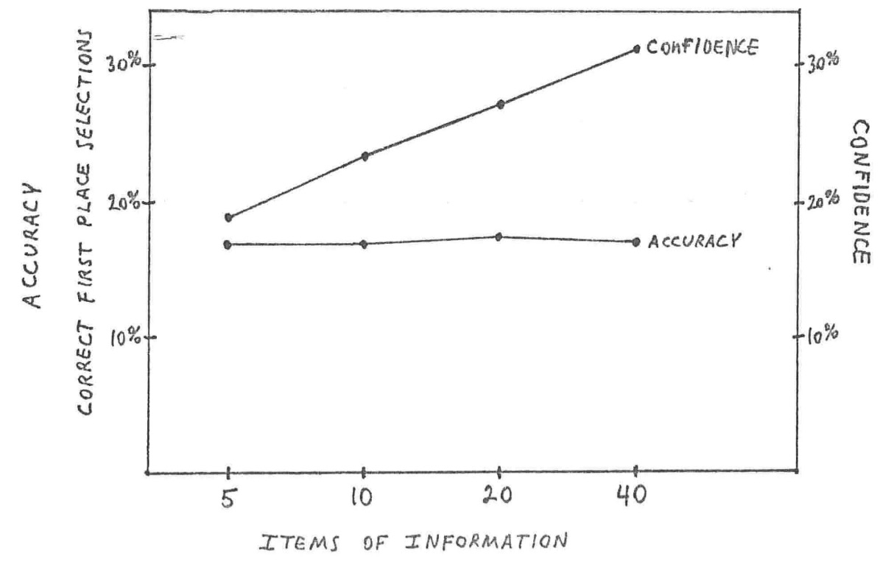

# 5.6 Additional information

One possible way to improve decision making might be to simply give people more information.

That information can then be used as an input into a model, or as a source of data for an expert. If that information comprises the cues someone requires to make a decision, or gives them more information about the relationship between the cues and the outcome of interest, it could improve decision quality.

But this is not always the case.

Paul Slovic (1973) reported research on horse race handicappers. They were shown a list of 88 variables relating to horses and their races, and were asked what 5, 10, 20 or 40 variables they would like to be given to help them decide which horses would finish in the first 5 positions in the race.

Then, for a series of races, they would be shown the first five variables, and asked to make a prediction. Then they would be given the next five and a chance to update, the next 10 and a chance to update, and then the final 20 variables and a last chance to update.

With only 5 variables, the handicappers got 17% of the first place finishers right. They did better than chance in making their predictions, as there were 10 horses in each race. How many did they believe they would get right? Across the group they estimated that they would get 19% right. Thus, their confidence was well calibrated to their accuracy.

So what happened when they were provided the next five variables, giving them 10 with which to make their judgement? 17% accuracy and 24% confidence. And with the full 40 variables? 17% accuracy, confidence over 30%. (What is the type of overconfidence being exhibited here?)

This is a common phenomena. Additional information results in little gain in accuracy, yet substantial increases in confidence. As another example, OsKamp (1965) found that psychologists presented with increasing levels of information to support a clinical diagnosis quickly reached a ceiling in their accuracy, but became increasingly confident with more information.

There are even some cases where the additional information degraded the predictions. Experimental participants predicting NBA outcomes had their accuracy decline when they were given team names in addition to performance statistics.

Research on this topic has shown that we are not completely naive. We do have some ability to judge between valid and invalid cues. Accuracy does sometimes increase for certain problems. But the general pattern is that confidence increases faster than accuracy. And this lack of calibration between accuracy and confidence may be more costly than the marginal gain in accuracy that might be achieved with more information.

## References

Hall et al. (2007) "The illusion of knowledge: When more information reduces accuracy and increases confidence", *Organizational Behavior and Human Decision Processes*, 103(2), 277-290, https://doi.org/10.1016/j.obhdp.2007.01.003

Oskamp (1965) "Overconfidence in case-study judgments", *Journal of Consulting Psychology*, 29(3), 261–265. https://doi.org/10.1037/h0022125

Slovic (1973) "Behavioral problems of adhering to a decision policy", Paper presented at *The Institute for Quantitative Research in Finance*, May 1, Napa, CA.

